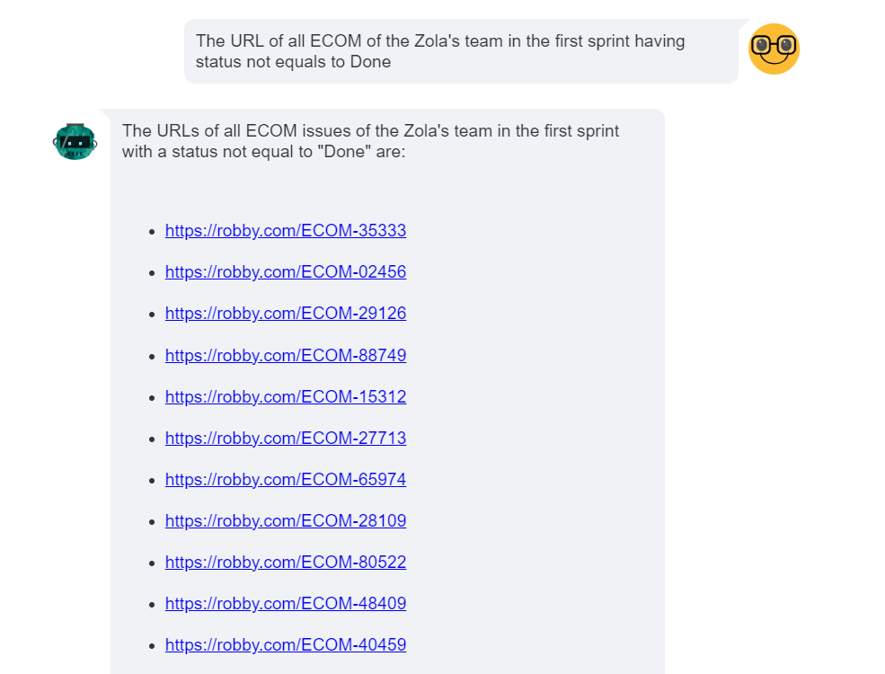

# langchain_pandas_agent

langchain_pandas_agent is a project that leverages the capabilities of the LangChain library and OpenAI 3.5 to create an intelligent agent for the pandas library. This agent can perform various data manipulation and analysis tasks on pandas DataFrames, making data science workflows more efficient and intuitive.

## Table of Contents

- [Introduction](#introduction)
- [Features](#features)
- [Installation](#installation)
- [Demonstration](#demonstration)

## Introduction

The langchain_pandas_agent project integrates LangChain and OpenAI 3.5 to build an agent that can interact with pandas DataFrames. This project aims to simplify data manipulation tasks by providing a natural language interface for executing complex pandas operations. 

### Key Highlight

This project demonstrates how to query a list of Jira tasks exported in CSV format using natural language. By utilizing the powerful combination of LangChain, OpenAI, and pandas, users can perform advanced data queries and manipulations on Jira task exports intuitively.

## Features

- **Natural Language Processing**: Use natural language commands to manipulate pandas DataFrames.
- **Integration with OpenAI 3.5**: Leverage the powerful capabilities of OpenAI's language model to understand and execute commands.
- **LangChain Integration**: Utilize LangChain to manage the workflow and execution of commands.
- **CSV File Handling**: Load and query Jira tasks exported in CSV format using natural language.

## Installation

To install langchain_pandas_agent, you need to have Python installed on your machine. You can install the necessary packages using pipenv:

```bash
pipenv install pandas numpy python-dotenv langchain langchain-openai openai langchain-experimental tabulate streamlit streamlit-chat
```

## Demonstration

Below are some example queries and their results to demonstrate the capabilities of the langchain_pandas_agent:

#### Example 1: Show the list of teams and how much story points in their ECOM with status equal to Done for the 3 sprints


#### Example 2: The URL of all ECOM of the Zola's team in the first sprint having status not equal to Done


